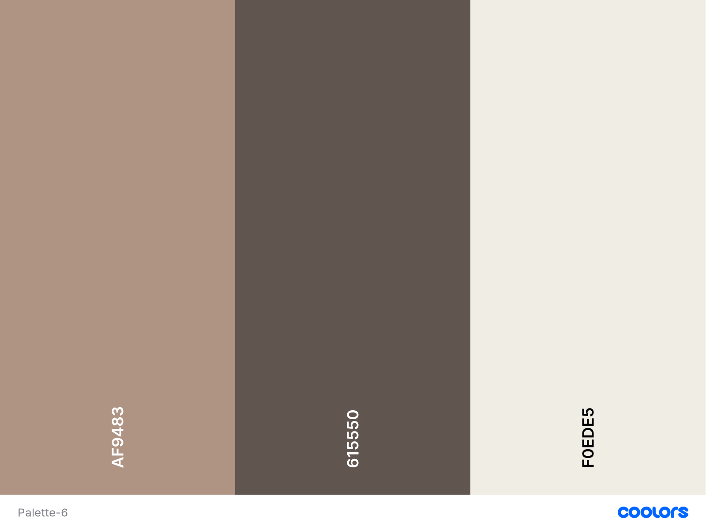

Project description goes here **place holder**

## Contents ##

## UX (User Experience) ##

### Project Goals ###

The **goal** of this project is to build a ***.

### User Goals ###

- **Book** a table in the coffee shop for a specific time.
- **Order** a coffee **online** when booking a table.
- **Order** a coffee **online** for collection.
- **Link** to the coffee shop social media sites.

### User Stories ###

- As a **user**, I want to see a **menu** for the coffee shop.
- As a **user**, I want to know **where** the coffee shop is **located on a map**.
- As a **user**, I want to be able to get **directions** to the coffee shop from where I am located.
- As a **user**, I want to be able to **book a table online** for a **chosen time** slot to have coffee in the coffee shop.
- As a **user**, I want to be able to **book a table as well as a coffee online** for a **chosen time** slot.
- As a **user**, I want to **order my coffee online** to takeaway.
- As a **user**, I can **enter** my contact **details** to **secure my booking**.
  - The required fields should be a *name*, an *email address* and *coffee order* for the booking confirmation.
- As a **user**, I can place an order for my coffee in advance of my visit.
- As a **user**, I can get a **notification to check** my order and **make the changes** if necessary **before** sending it to the coffee shop.
- As a **user**, I can **contact** the shop for any order problems using their **social media** channels, **call** them or **email**.

### Site Owner Goals ###

- As a **site owner**, I want to *** .
- As a **site owner**, I want to *** .
- As a **site owner**, I also want to *** .

### User Requirements and Expectations ###

#### The site should have ###

- 
- 
- 
- 
- 
- 
  
### Design Choices ###

#### Fonts ####

We have chosen [Josefin](https://fonts.google.com/specimen/Josefin+Sans?query=jose#standard-styles) for all of the headers and [Raleway](https://fonts.google.com/specimen/Raleway?query=ralew#standard-styles) the rest of the text.

#### Colours ####

We have chosen the colour that say *"coffee now please!"*, applealing to the eye and also compliments the design of the project.


- *Grullo* (AF9483) - Light soft brown
- *Umber* (615550) - Dark bronw
- *Albaster* (F0EDE5) - Off white

These coulours will compliment each other well when used accross the site creating pleasant ambience.

#### Wireframes ####

We designed our site moc-ups using [balsamiq wireframes](https://balsamiq.com/). We were focusing on defining basic layout structure of the site and identifying how displays would change on different screen sizes such as [mobile](/wireframes/mobile.jpg), [tablet](/wireframes/tablet.jpg) and [desktop](/wireframes/desktop.jpg).

---  

## Technologies ##

### Languages ###

- [HTML](https://developer.mozilla.org/en-US/docs/Web/HTML)
- [CSS](https://developer.mozilla.org/en-US/docs/Web/CSS)
- [JavaScript](https://developer.mozilla.org/en-US/docs/Web/JavaScript)

### Libraries ###

- [jQuery](https://jquery.com/)
- [Popper](https://popper.js.org/)
- [Bootstrap](https://getbootstrap.com/)
  
### Tools ###

- [Git](https://git-scm.com/)
- [GitHub](https://github.com/)
- [Visual Studio Code](https://code.visualstudio.com/)
- [Font-Awesome](https://fontawesome.com/icons?d=gallery)
- [Google fonts](https://fonts.google.com/)
- [Color editor](https://coolors.co/)
- [Image editor](https://www.birme.net/)

---

## Features ##

### Features Implemented ###

- Responsive design
- User friendly display
- Navbar with easy navigation
- Functional booking form
- Google maps API for location services
- Social media links
  
### Future Features ###

- User accounts to store personal details securely.
    - GDPR: Privacy and cookie policy statements.
    - Sign up for marketing emails and special offers.
- Include a shopping cart facility.
    - Use discount voucher codes in the shopping cart.
- Bookmark the site quickly and easily to encourage repeat visitors.


---

## Testing ##

Testing information can be found in a separate [testing.md](testing.md) file.

---

## Bugs ##

---

## Deployment ##

The website was developed using both *GitPod* and *Visual Studio Code* and using *Git* pushed to *GitHub*, which hosts the repository. I made the following steps to deploy the site using *GitHub Pages*:

- Opened up **GitHub** in the browser.
- Signed in with my **username** and **password**.
- Selected my **repositories**.
- Navigated to **AlexNexton/BI-Team-5**.
- In the top navigation clicked **settings**.
- Scrolled down to the **GitHub Pages** area.
- Selected **Master Branch** from the **Source** dropdown menu.
- Clicked to **confirm** my **selection**.
- [BI-Team-5](https://alexnexton.github.io/BI-Team-5/) is now **live** on **GitHub Pages**.

### Running BI-Team-5 Locally ###

Cloning BI-Team-5 from GitHub:

- Navigate to **AlexNexton/BI-Team-5**.
- Click the green **Clone or Download** button.
- **Copy** the url in the dropdown box.
- Using your favourite **IDE** open up your preferred terminal.
- **Navigate** to your desired file location.

Copy the following code and input it into your terminal to clone BI-Team-5:

```git clone https://github.com/AlexNexton.BI-Team-5```

---

## Credits ##

### Audio (IF USED) ### 

### Images ###

You can find the images used for the site [here](assets/img). We have sourced them through various websites, which are free to use:

- cropped-coffee-cup.jpg originally sourced from the [Pikrepo website](https://www.pikrepo.com/frvwp/coffee-art-in-white-cup)
- cropped-tea-cup.jpg originally sourced from the [Pikrepo website](https://www.pikrepo.com/fryfx/beige-glass-tea-cup-and-saucer-on-top-of-brown-wooden-surface)
- cropped-iced-drinks.jpg by Jonas Jacobsson originally sourced from the [Unsplash website](https://unsplash.com/photos/ujenujDrMjc)

### Colour ###

We have identified the colour palette on [W3](https://www.w3schools.com/)

### Image editing ###

- We have used snippet tool for capturing screengrabs which we have saved as images.
- MS Paint 3D (DESCRIBE HERE IF USED)
- A handy [Birme](https://www.birme.net/?target_width=300&target_height=300&quality=100&border_width=1&border_color=%23bd3d3a) site allowed us to resise the images all at once.

### Acknowledgements ###

- [W3Schools](https://www.w3schools.com/) for just being a constant source of help and inspiration!
- [Bootstrap Carousel with Controls](https://getbootstrap.com/docs/4.5/components/carousel/) code.
- [Bootstrap Borderless Table](https://getbootstrap.com/docs/4.5/content/tables/) code.
- [Stack overflow](https://stackoverflow.com/questions/14977392/bootstrap-carousel-remove-auto-slide) for help with removing the carousel auto-slide in Bootstrap.
- [San Francisco State Univerity](https://its.sfsu.edu/projects/resources) PMO Resources webpage where the original UAT Training Plan document was sourced
- [usersnap.com blog](https://usersnap.com/blog/user-acceptance-testing-example/) which was the inspiration for the modified UAT Testing document and wording.
---
